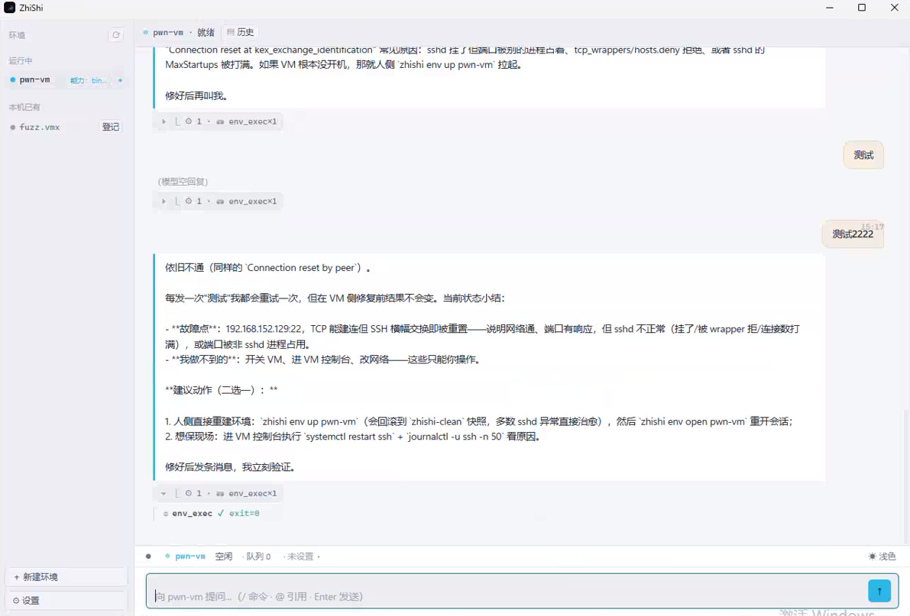
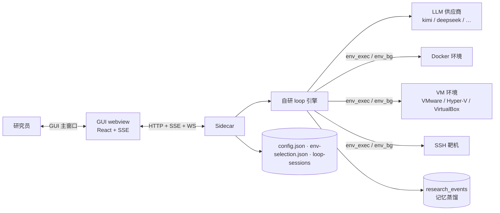

# ZhiShi — 安全研究 Harness

<p align="center">
  <picture>
    <source media="(prefers-color-scheme: dark)" srcset="assets/logo-dark.png">
    
  </picture>
</p>

**v1.4.0 · 安全研究领域的 agent harness：环境融合、原生工具、原生代码。**

[](https://github.com/LielingAi/ZhiShi/tags)
[](LICENSE)
[]()
[]()
[](https://zhishi.help)

> 📖 **新用户从这里开始：[使用指南](docs/user-guide.md)** —— 安装、选环境、配模型、GUI 操作、常见问题。
> 📦 **Windows 安装包：[GitHub Releases 下载最新版](https://github.com/LielingAi/ZhiShi/releases/latest)**（NSIS 安装包 / 便携 ZIP）。

> 以实战出发的**漏洞研究专用 harness**。

> **免责声明**：本工具仅面向**合法授权**的安全研究（漏洞挖掘、复现、渗透测试）。禁止对未授权目标使用；使用者须遵守当地法律法规，作者不承担任何非法使用产生的后果。

---

## 实战成果

CTF 通关明细（部分知名平台）：

| [Pwnable.kr](https://pwnable.kr) | [Hacker101 CTF](https://ctf.hacker101.com) | [HackThisSite](https://www.hackthissite.org) | [ROP Emporium](https://ropemporium.com) | [VulnHub](https://www.vulnhub.com) |
|---|---|---|---|---|
| 100% | 98% | 96% | 91% | 90% |

### 完整复现

> 🔴 **[CVE-2026-34621](https://www.cve.org/CVERecord?id=CVE-2026-34621) · Adobe Acrobat Reader — 原型污染（CVSS 8.6）**
> 从触发条件到武器化的完整利用链复现。

### 提报 CVE

| CVE | 目标 | CVSS |
|---|---|---|
| CVE-2026-66319 | Microsoft | 待公开 |
| [CVE-2026-0961](https://www.cve.org/CVERecord?id=CVE-2026-0961) | Wireshark · BLF 文件解析崩溃 DoS | 5.5 |
| [CVE-2025-1162](https://www.cve.org/CVERecord?id=CVE-2025-1162) | Job Recruitment 1.0 | 5.3 |
| [CVE-2025-1171](https://www.cve.org/CVERecord?id=CVE-2025-1171) | Real Estate Property Management System 1.0 | 5.1 |
| [CVE-2025-1170](https://www.cve.org/CVERecord?id=CVE-2025-1170) | Real Estate Property Management System 1.0 | 5.1 |
| [CVE-2025-1163](https://www.cve.org/CVERecord?id=CVE-2025-1163) | Vehicle Parking Management System 1.0 | 4.8 |
| [CVE-2025-1164](https://www.cve.org/CVERecord?id=CVE-2025-1164) | Police FIR Record Management System 1.0 | 4.8 |

### 在途

- **7 个漏洞**在微软审核流程中
- 白盒审计挖掘了 200+ 漏洞，部分漏洞正在提报 CVE

### 浏览器漏洞

- 多个 Chrome / Firefox 漏洞分析与复现

---

## 它是什么

ZhiShi 是给安全研究员的工作台：二进制利用、渗透测试、白盒审计、AI 安全四个研究方向。

| 支柱 | 含义 |
|---|---|
| **环境融合** | 环境归 agent 管——建、跑、快照、回滚。底座：Docker / VMware / Hyper-V / VirtualBox / SSH 靶机。 |
| **原生工具** | 工具都在环境里。发现、调用、验证——不打包工具，只做协作面。 |
| **原生代码** | 以安全研究为核心的代码能力——exp、shellcode、fuzz harness，写了就编译，崩了就改。 |

一次真实研究会话长这样：

```
环境 pwn-vm（vm） · 能力：binary · pentest

❯ 分析 /home/researcher/ret2win/vuln，gets 溢出，打通拿 flag

⏺ env_exec(checksec ./vuln)
   Stack: No canary · PIE: No · win @ 0x401196
⏺ env_exec(python3 exp.py)
   exit=0

⏺ 偏移 72（cyclic + core 确认），垫 ret gadget 对齐 movaps，
   跳 win 拿到 flag{ret2win_pwned_successfully}
```

一次 CTF 实战的完整链路（命令执行绕过 → 任意命令构造 → 环境侦察 → 凭据泄露 → 数据库取 flag）。

## 核心特性

### 控制面：GUI 主窗口（1.3.9 起 TUI 退役）



- 环境侧栏三组（运行中/已停止/本机已有）+ 新建环境四步向导（docker 配方 / VM 配方 / 接入已有 / 手动 SSH）+ 本机发现登记/去重
- 块化会话流（输入=块首、结论聚合亮顶、thought/工具卡折叠、抽屉详情）+ 运行中输入即纠偏
- 环境准入闸（已停止不可进入，先启动）+ 三态判定统一
- 决策面板（模型方向分歧提请人拍板 + 专家依据区 + 决策块落流可追溯）
- 历史面板（会话分组/搜索/只读回看/载回续跑）+ 会话管理（重命名/置顶/归档/删除）
- attach 真终端（xterm + WS pty：docker exec -it / ssh -tt）+ 一次性命令执行双模式
- `/` 命令面板、`@` 补全（环境/文件/子代理/工具）、`Ctrl+R` 历史、Esc 链、深浅主题
- 越界动作模态（写宿主等四类，逐次问人，无「永远允许」）
- 后台长驻进程状态栏可见（`⛁ fuzz · 跑着`）+ 退出插行
- 桌面图标/托盘/二次实例 → 聚焦 GUI 主窗口（自启静默不弹窗）

### 引擎：自研 loop（harness 本体）

| 面 | 内容 |
|---|---|
| 工具 | `env_exec`（一次性）· `env_bg`（后台长驻：start/poll/log/kill/list）· `delegate_task`（子任务，按名派发专用 agent）· `research_log`（研究留痕） |
| 边界 | 规则硬闸（工具白名单 / 环境就绪 / 凭据不泄进环境）+ 输出净化 + 越界问人通道 |
| 上下文 | 安全定制压缩：死路（非零 exit）与突破口（flag/CVE）永不裁 |
| 记忆闭环 | research_events → 按研究域蒸馏（经验不跨域，置信度 0.xx 分级）→ 逐 turn 反喂系统提示 |
| 认知内核 | 第一性原理五层认知（深度理解 → 对抗共情 → 溯因推理 → 认识论谦卑 → 远距类比）+ 置信度校准锚点（< 0.60 不报告）+ 硬排除清单 |
| 专家知识 | `expert.db`——权威知识层（思路/技术/SOP，人审定才进库）：卡住了 LLM 无把握时的最后落脚点，`expert_search` 检索；留痕可挂 `expert_refs` 追溯「决策依据 E#N」；现成 JSON/YAML 直接 `zhishi expert import` 批量入库（见导入指南） |
| 研究报告 | `/export` 一键出报告目录（report.md + evidence/ PoC 本体）：骨架事实钉死 + LLM 填肉、按域模板、敏感项清单知情、显式脱敏可选 |
| 能力包 | skills 提示词注入（binary-exploit / vuln-triage / native-code-loop / range-ops / pentest / whitebox-audit / ai-security + 用户库 `~/.zhishi/skills/`） |
| 子代理 | bundled-agents：fuzz-runner / crash-triager / vuln-hunter / hypothesis-tester / critic；`/tasks` 面板看工作现场与完整 transcript |
| 域包 | `bundled-domains/<域>/domain.json` —— 环境类型 / skill / 子代理 / 信号 / 验收一键声明，`zhishi domain check` 就绪自检 |
| 模型 | 8 家内置供应商端点（kimi / deepseek / openai / moonshot / 通义 / 智谱 / 硅基流动…），`zhishi model set-key <id> <key>` 后自动拉模型列表，GUI 状态栏切换（只显示已配置供应商） |

## 快速开始

> 发行版（推荐）：[GitHub Releases](https://github.com/LielingAi/ZhiShi/releases/latest) 下载 Windows 安装包/便携 ZIP → 安装 → 点击图标即开 GUI 主窗口（后台宿主管理 sidecar 生命周期）。要求 Node.js ≥ 22（安装包已内置）。

开发态直跑源码：

```bash
npm install

# 一条命令：Tauri 开发壳（GUI 窗口 + sidecar + vite HMR）
npm run tauri:dev

# 或分开跑——终端 1：sidecar（引擎 + admin API）
node --import tsx/esm src/server/index.ts --agent-dir "$PWD"

# 终端 2：GUI（vite dev server，浏览器/窗口连 sidecar）
npm run dev:gui
```

GUI 打开即进环境侧栏：选环境（没有就从四步向导新建），之后一切研究都在环境内进行。

### 环境管理

```bash
zhishi env recipes                    # 内置环境类型：dev / pwn / fuzz / rev / code-audit / pentest / ai-security + VM 变体
zhishi env up pwn-vm                  # 从环境类型建环境
zhishi env adopt pwn-vm --vm <vmx> --user <用户>   # 纳管已有 VM
zhishi env list
zhishi env ps
```

### 模型配置

```bash
zhishi model list
zhishi model set-key deepseek <apiKey>
zhishi model verify deepseek
zhishi model set-default deepseek
```

### Skills 与域包

```bash
zhishi skill list              # 用户库
zhishi skill disable docx      # 禁用（内置同名也生效）
zhishi domain list             # 域包清单
zhishi domain check binary     # 就绪自检（引用完整 + 工具漂移 + 验收清单）
```

## 编译与运行

### 编译（Node 侧产物，esbuild 打包）

```bash
npm run build:server        # sidecar → src-tauri/resources/server-dist.js（ESM）
npm run build:cli           # CLI → src-tauri/resources/cli/zhishi.js + zhishi.cmd（ESM + shebang）
npm run build:tsx-runtime   # 插件 TS 转译运行时 → src-tauri/resources/tsx-runtime/
npm run sync:bundled-skills # 内置 skills 同步
```

### 编译后运行（不经 Tauri 壳）

```bash
# 终端 1：sidecar（编译产物，与开发态 tsx 启动等价）
node src-tauri/resources/server-dist.js --agent-dir "$PWD"

# 终端 2：GUI（vite build 产物随包分发；开发态 npm run tauri:dev 已含窗口）
```

### 发行包（Windows：NSIS 安装包 + 便携 ZIP）

```bash
npm run tauri:build   # 或 scripts/build/build_windows.ps1（完整发布流程）
```

产物在 `src-tauri/target/x86_64-pc-windows-msvc/release/bundle/`。安装后：Tauri 壳负责 GUI 窗口 + sidecar 生命周期与自更新，`zhishi` 命令同步到 `~/.zhishi/bin/`。构建细节与验证清单见 `docs/spec/windows-release-build.md`。

## 架构



| 模块 | 位置 |
|---|---|
| 引擎（loop / 工具 / 边界 / 蒸馏） | `src/server/loop/`、`src/server/memory/` |
| 环境层（引擎探测 / 环境类型 / 生命周期 / 纳管） | `src/server/environment/` |
| admin API（sidecar HTTP 面） | `src/server/admin-api.ts`、`src/server/index.ts` |
| GUI（React + zustand + xterm；会话/环境/决策/历史） | `src/gui/` |
| CLI 统一入口（子命令：mcp/model/env/expert/term/…） | `src/cli/zhishi.ts` |
| 内置环境类型 / 技能 / 域包 / 子代理 | `bundled-environments/`、`bundled-skills/`、`bundled-domains/`、`bundled-agents/` |

## 验证状态

| 项 | 状态 |
|---|---|
| 单元测试 | 1900+ 全绿；`tsc --noEmit` / `eslint` 零错 / depcruise 架构边界强制 |
| 活体回归 | `npm run smoke` 一键（真端点 + 真 VM，m1-m4 全链路）；产物级 smoke（打包产物跑关键路径） |
| 活体 dogfood | ret2win 全程打通；1.1.8 三域实战验证（whitebox 埋雷审计全中 / pentest 全链拿 flag / ai-security 注入探针全拒），详见 `docs/design/` |
| GUI 全链路真机 | 选环境 / 流式 / 中断 / 回退 / 快照回滚 / attach 终端 / 决策面板 / 历史面板 / 越界模态 / 后台任务全部通过（1.3.0-1.3.8 实机走查） |
| 域内容件 | 四域齐备（binary / pentest / whitebox / ai-security）并经实战验证 |

## 文档

| 文档 | 内容 |
|---|---|
| `docs/roadmap.md` | 版本任务池（当前线：1.3.x GUI 主线——1.3.9 TUI 退役执行） |
| `docs/user-guide.md` | 使用指南（安装、选环境、配模型、GUI 操作、常见问题） |
| `docs/expert-import-guide.md` | 专家知识导入指南（命令/字段规范/JSON+YAML 格式，附可导入的 `expert-import.demo.yaml`） |
| `docs/design/` | 各版本设计与分析稿（1.1.6–1.2.7、distill-eval、1.3.4 TUI 退役评估） |
| `docs/spec/` | 长期契约与专项设计（见下） |
| `docs/spec/expert-knowledge-plan.md` | 专家知识层迭代与技术方案（1.2.1-1.2.3） |
| `docs/spec/security_researcher_agent_design.md` | 产品设计（决策记录 D1–D31） |
| `docs/spec/security_researcher_agent_tech_plan.md` | 技术方案 |
| `docs/spec/tui_tech_spec.md` / `docs/spec/tui-rebuild-plan.md` | 已退役（1.3.9），仅供历史归档 |
| `docs/spec/env-bg-design.md` | 环境内长驻进程通道设计底账 |
| `docs/spec/design-spec.md` | 交互契约（界面行为、状态、流） |
| `docs/spec/windows-release-build.md` | Windows 发行构建与验证清单 |
| `CLAUDE.md` | 开发红线与命令（开发前先读） |

## 开发

```bash
npm run typecheck    # tsc --noEmit
npm run lint         # eslint + depcruise
npm run test:unit    # vitest 单测
npm run test         # 全量测试
```

提交遵循 Conventional Commits；不提交敏感信息。

## 致谢

zhishi 的 loop 引擎以 [pi](https://github.com/earendil-works/pi)（`@earendil-works/pi-agent-core`，MIT）为底座——感谢 pi 提供传输抽象、状态管理与附件支持等通用能力，安全研究定制层建立在它之上。

---

喜欢 zhishi？[点个 star](https://github.com/LielingAi/ZhiShi/stargazers)，让研究被看见。有发现就开 issue，想动手，欢迎 PR。

## License

[AGPL-3.0](LICENSE)
